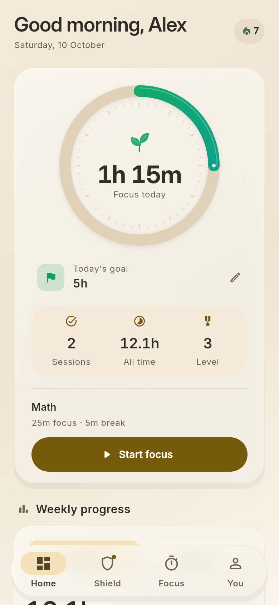
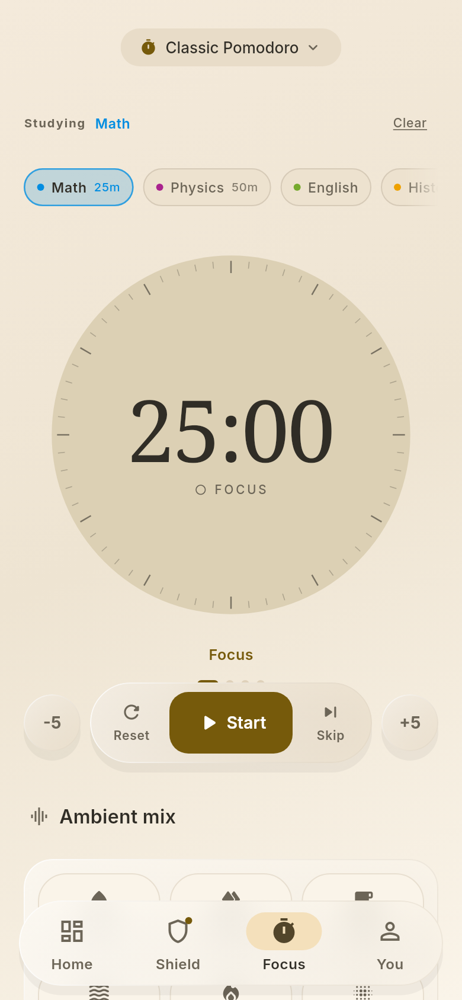
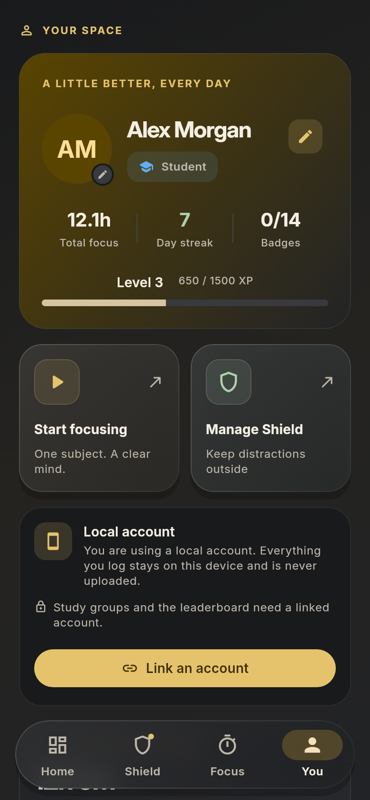

LESS SCROLLING. MORE STUDYING.

# FocusForge

### Close the feed. Keep the lecture.

A study companion that protects your attention and makes your progress visible.

**Free & open source** · No ads · No subscriptions

[Download for Android](https://github.com/MufasaXz/focusforge/releases/latest) · [Release notes](CHANGELOG.md) · [Report an issue](https://github.com/MufasaXz/focusforge/issues)

Version 1.0.3 · Android 7.0+

 

  
  
  
  

Home · Day &nbsp; / &nbsp; Shield · Day &nbsp; / &nbsp; Focus · Day &nbsp; / &nbsp; You · Dark

---

**Protect your attention.** Block distracting apps, set daily time budgets, or
shield them only while you focus. Filter YouTube Shorts and feeds while keeping
lecture links available.

**Make the clock yours.** A flat tan countdown dial with bundled serif numerals, warm ivory Day mode,
charcoal Dark mode and frosted cards give studying a quieter workspace.
Choose a clock face and palette in You. Add one of three Android widgets from
your launcher's Widgets menu: **Retro clock** for the countdown and subject,
**Study session** for a compact subject timer, or **Daily goal** for completed
minutes, remaining minutes and a growing progress ring. Widgets follow your
Day/Dark theme and weekday goals; tap a timer to focus or the goal to open Home.

**Find your rhythm.** Use Pomodoro presets or your own plan, tag a subject, and
mix ambient sounds. A full-screen timer keeps the next step simple.

**Pause before the scroll.** A guided 4–7–8 breathing break gives you room to
decide whether to open a shielded app. Strict Mode adds a deliberate cooldown
before ending your commitment.

**See the work add up.** Daily goals, subject totals, weekly charts and streaks
show the time you actually studied. Earn XP and badges along the way.

**Study with your circle.** Join private groups with an invite code, work toward
a shared weekly goal, and see who has a focus timer running.

**Support from a parent.** Pair two devices to share study summaries and let a
parent manage distraction rules.

---

Start with your subjects and a daily goal. The timer works without an account;
Shield uses optional Android permissions. Detailed session logs stay on your
device. Groups and parent control share limited summaries when you choose them.

[Firebase setup](docs/firebase-setup.md) · [Installation help](docs/play-protect.md) · [MIT license](LICENSE)
