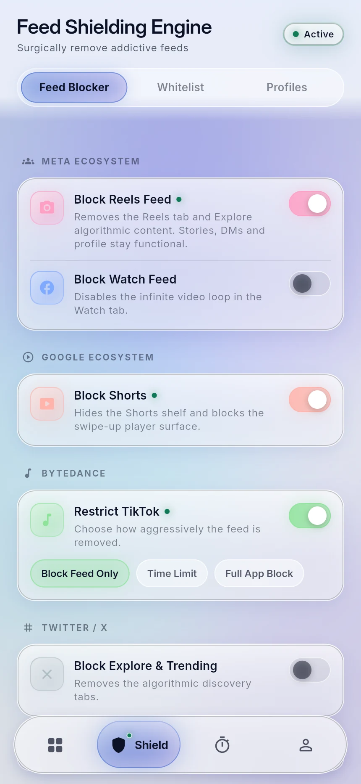
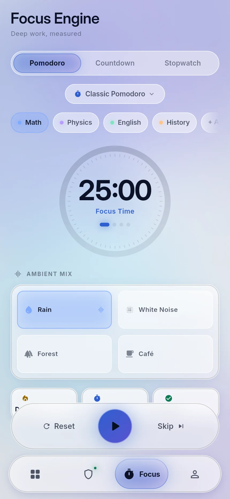
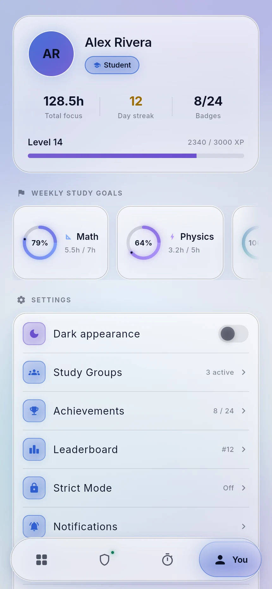
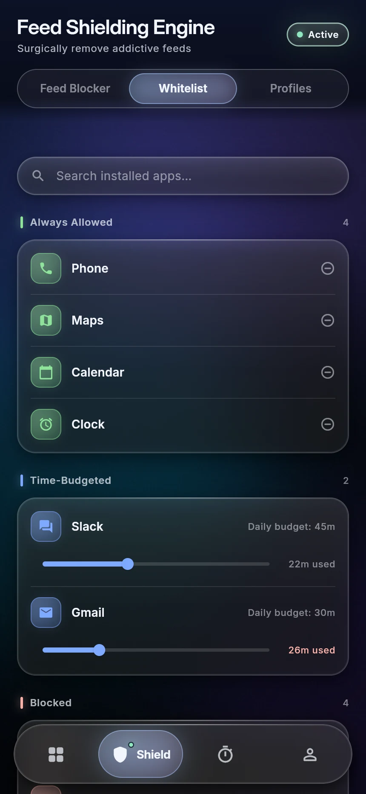
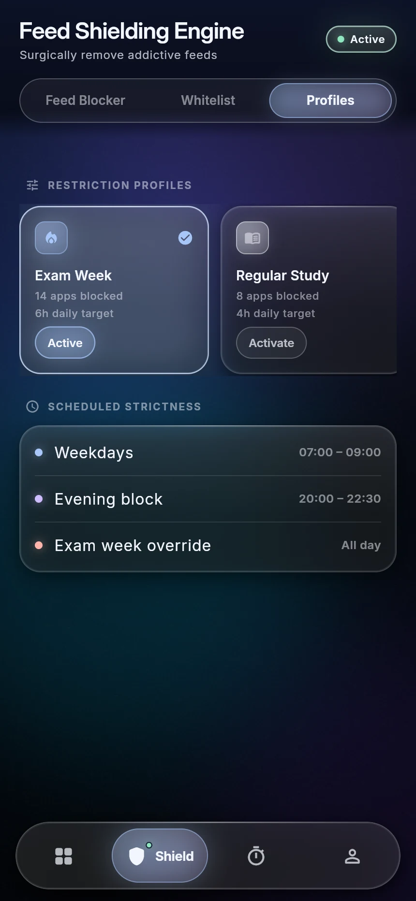
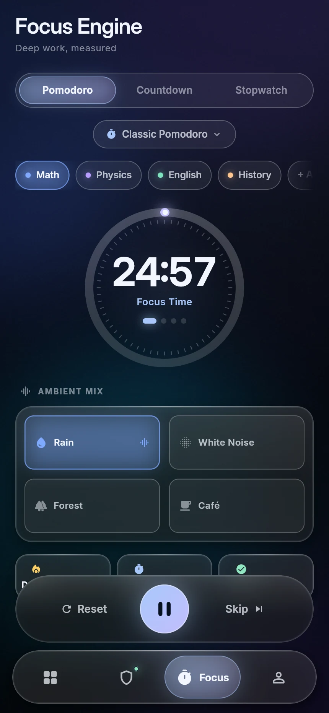
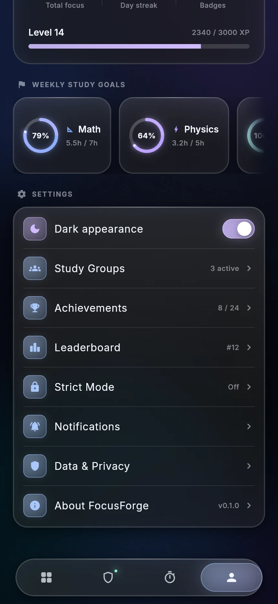

<div align="center">

# 🔥 FocusForge

**An open-source, privacy-first study companion.**
Block the feeds, run the timer, watch the streak grow.

[](https://flutter.dev)
[](https://dart.dev)
[](LICENSE)
[](CONTRIBUTING.md)
[](#)

</div>

---

## What this is

FocusForge combines what normally takes four apps: **app shielding**, a
**Pomodoro engine**, **study analytics** and **gamification** — in one free,
open-source package with no ads and no account required.

This repository currently contains the **complete UI shell**: every screen,
component and motion pattern of the design system, running against mock data.
Native shielding services and the Firebase backend land next.

## Screenshots

<div align="center">

| Dashboard | Shield | Focus | Profile |
|:---:|:---:|:---:|:---:|
|  |  |  |  |

| Whitelist | Profiles | Timer running | Settings |
|:---:|:---:|:---:|:---:|
|  |  |  |  |

</div>

## The design system

The UI follows a **deep glass** language built for 2026 hardware, where GPU
compositing finally makes backdrop blur cheap enough to use properly.

**The floating navigation bar** is the centrepiece:

- It **floats** — inset from every edge, so content scrolls visibly past its
  sides instead of being hidden behind an edge-to-edge slab.
- The active indicator is a **morphing pill**. It stretches while travelling and
  settles with a spring overshoot (`easeOutBack`) rather than snapping.
- It **shrinks on scroll** — labels drop out and the bar shortens as you scroll
  down, then restores on the way back up.
- Its label expands out of the icon on selection, so the bar stays quiet until
  you actually need the word.

**Glass surfaces** are built from four stacked details: a translucent fill, an
inset second rim that reads as edge *thickness*, a soft sheen across the upper
half, and a bright specular line along the top edge. A real `BackdropFilter` is
used sparingly — only for surfaces that genuinely float — because stacking
blurred layers is still the fastest way to wreck a frame budget.

**The canvas** is a gradient with slow-drifting colour blobs, a corner light
source, a vignette and a film-grain overlay. The grain is generated once and
tiled; it is what stops large dark gradients from banding on OLED panels.

**Motion** follows one rule set: fast in, springy out. Presses scale to 0.96 in
90 ms and release on an overshoot curve over 340 ms. Screens use a fade-through
transition, and dashboard sections stagger in at 55 ms intervals.

### Tokens

| Token | Value | Use |
|---|---|---|
| `accentPrimary` | `#A8C7FA` | Primary actions, progress |
| `accentSecondary` | `#D0BCFF` | Secondary elements, XP |
| `success` | `#8FE7C0` | Active shields, completed |
| `danger` | `#FFB4AB` | Over-limit, strict mode |
| `gold` | `#FFD166` | Streaks, achievements |

Radii: hero `28` · card `22` · list item `16` · tile `12` · pill `999`.
Spacing is a strict 8 dp grid. Type is Inter, with Inter Display for the largest
sizes; every numeric style uses tabular figures so digits never jitter.

Day mode is the default. Dark mode shifts the accents to their pastel neon
variants, which is where the glass treatment reads best — toggle it from
**Profile → Dark appearance**.

## Screens

**Dashboard** — greeting header with streak, a 188 dp progress ring with tick
marks and a lit centre, three stat chips, a weekly bar chart with gridlines and
an accented "today" bar, a five-level focus heatmap, per-app usage rows with
shield toggles, and a subject breakdown bar.

**Shield** — a genuinely frosted sticky header (content blurs as it scrolls
under), a three-way segmented control, grouped feed-blocking rows with inline
mode chips, a three-tier whitelist (always allowed / time-budgeted / blocked)
with a search field and budget sliders, and horizontally scrolling restriction
profiles.

**Focus** — Pomodoro / Countdown / Stopwatch with a **working timer** that
advances segments and rolls into breaks, a 60-tick progress ring, subject tags,
a multi-select ambient mixer, and a session dock pinned above the nav bar so the
primary action is always reachable.

**Profile** — hero card with avatar, persona badge and progression stats, an XP
bar, horizontally scrolling weekly subject goals with mini rings, and a settings
list that includes the live theme switch.

## Getting started

```bash
git clone https://github.com/MufasaXz/focusforge.git
cd focusforge

flutter pub get

# Desktop / device
flutter run

# Or run it in a browser
flutter run -d chrome
```

Requires **Flutter 3.47+** (Dart 3.13+). No other dependencies — the project
intentionally ships with zero third-party packages so the build stays
reproducible and offline-friendly.

### Build for web

```bash
# --no-web-resources-cdn bundles CanvasKit locally instead of pulling it from
# gstatic, which makes local previews fast and deterministic.
flutter build web --release --no-web-resources-cdn
```

## Project structure

```
lib/
├── app/
│   ├── app.dart                 # MaterialApp, theme mode
│   ├── shell/app_shell.dart     # Tab host, scroll-aware nav state
│   └── theme/                   # Tokens, type scale, ThemeData
├── core/
│   ├── data/mock_data.dart      # Demo content (swap for Hive repositories)
│   └── utils/format.dart        # Duration / date formatting
├── shared/widgets/
│   ├── glass_nav_bar.dart       # Floating frosted navbar
│   ├── glass_surface.dart       # GlassPanel, pills, badges, press feedback
│   ├── glass_toggle.dart        # Switch + progress bar
│   ├── progress_ring.dart       # Ring with bloom, ticks, lit cap
│   ├── mesh_background.dart     # Canvas, blobs, grain, vignette
│   ├── segmented_control.dart   # Sliding segmented control
│   └── stagger.dart             # Staggered entrance
└── features/
    ├── dashboard/               # + widgets/ (chart, heatmap, apps, subjects)
    ├── shield/
    ├── focus/
    └── profile/
```

## Privacy

Screen-time analytics and usage data stay **on-device**. The backend — when it
arrives — will only ever hold auth profiles, study-group membership, opt-in
leaderboard scores and synced settings. No usage data leaves the device, ever.
You can export or delete everything at any time.

## App Store reality check

The anti-uninstall approach that some blockers use **will be rejected** by both
Google Play and Apple. FocusForge uses an emergency unlock with friction instead
(typed pledge + 60-second cooldown), which is both store-legal and more
effective. `AccessibilityService` on Android needs a clear privacy policy and a
written justification at review time; iOS ScreenTime requires the
`FamilyControls` entitlement.

## Contributing

Issues and PRs are welcome — see [CONTRIBUTING.md](CONTRIBUTING.md). Good first
issues are labelled in the tracker.

## License

[MIT](LICENSE) — free forever, no ads, no tracking, no premium tier.
