<div align="center">

# 🔥 FocusForge

**An open-source, privacy-first study companion.**
Block the feeds, run the timer, watch the streak grow.

[](https://flutter.dev)
[](https://dart.dev)
[](LICENSE)
[](CONTRIBUTING.md)
[](#)

</div>

---

## What this is

FocusForge combines what normally takes four apps: **app shielding**, a
**Pomodoro engine**, **study analytics** and **gamification** — in one free,
open-source package with no ads and no account required.

This repository contains the **complete front end**: every screen, component and
motion pattern of the design system, wired to a real state layer. Onboarding,
the focus timer, the analytics and every setting are live and persist locally
through `shared_preferences` — there is no mock data in any shipping screen.
Accounts are live too: `firebase_auth` backs `AuthService` on Android, and the
app falls back to an on-device implementation whenever Firebase is unavailable.
The one thing still missing is the native shield engine (Android
`AccessibilityService` / iOS `FamilyControls`), which sits behind an interface
that is already defined and exercised.

## Screenshots

<div align="center">

| Onboarding | First-run coach marks | Dashboard | Heatmap & weekly |
|:---:|:---:|:---:|:---:|
| 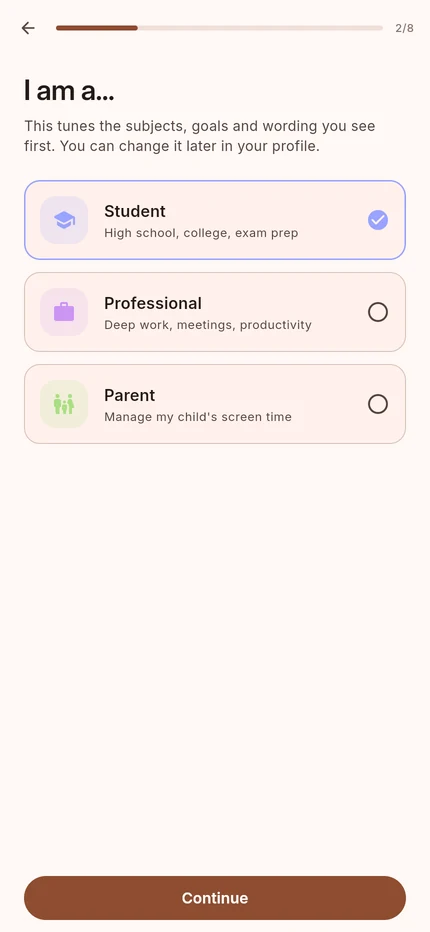 | 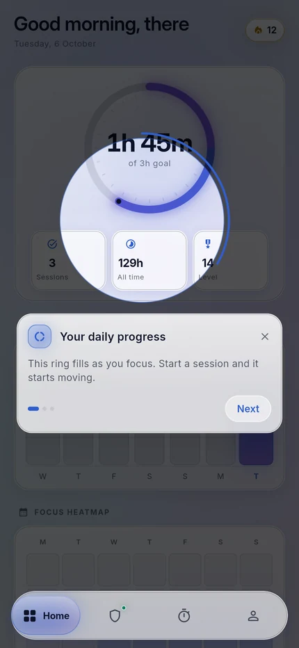 | 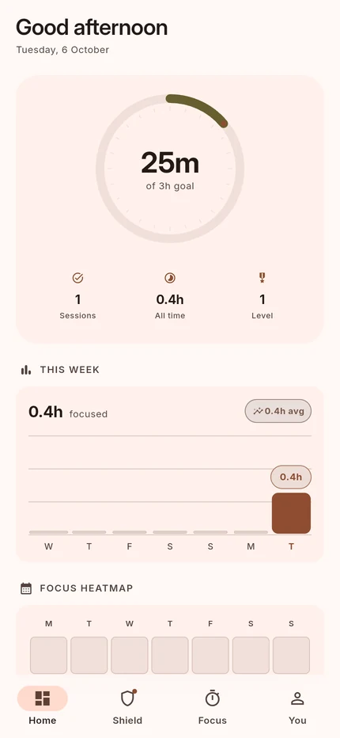 | 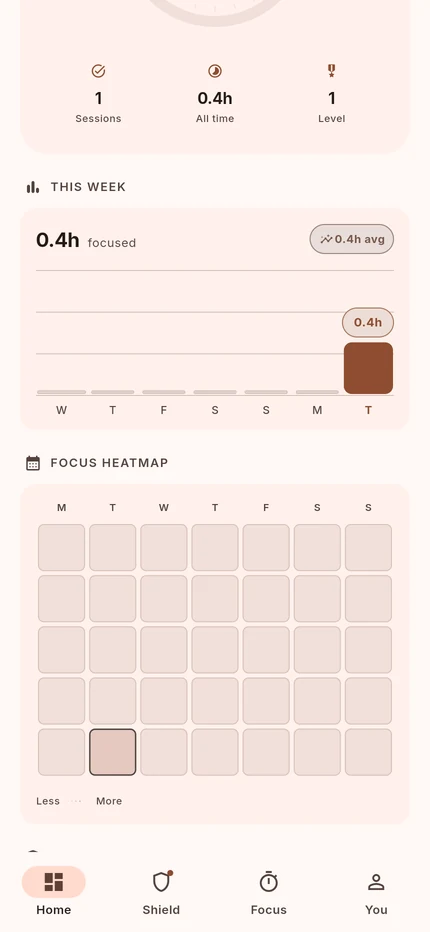 |

| Shield feed | Whitelist tiers | Restriction profiles | Focus |
|:---:|:---:|:---:|:---:|
| 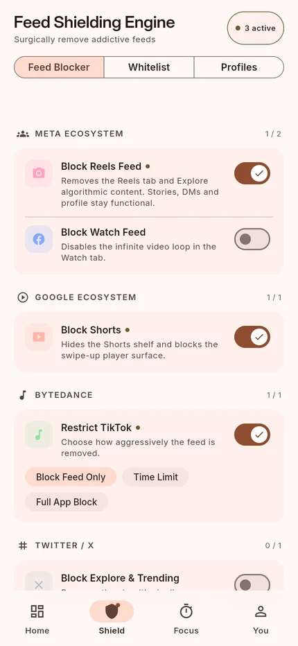 | 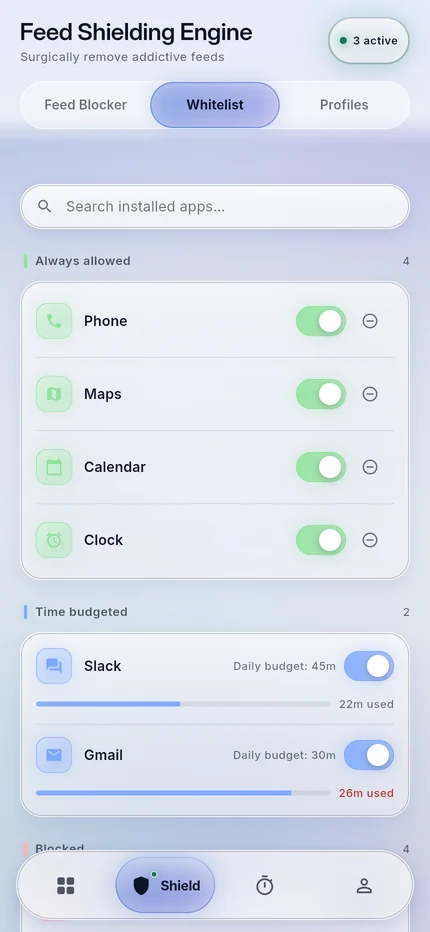 | 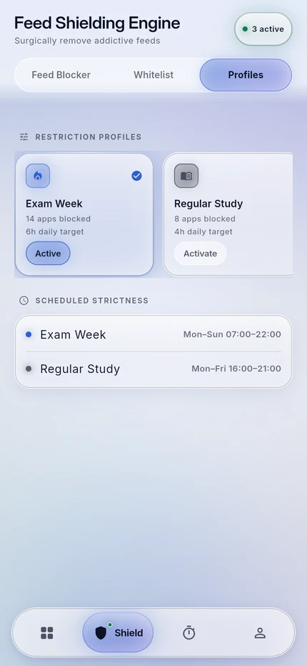 | 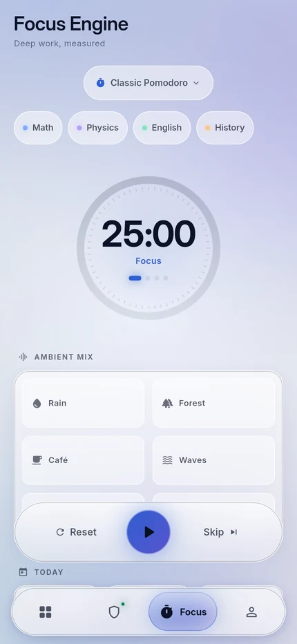 |

| Timer running | Profile | Strict Mode | Deep Breath Gate |
|:---:|:---:|:---:|:---:|
| 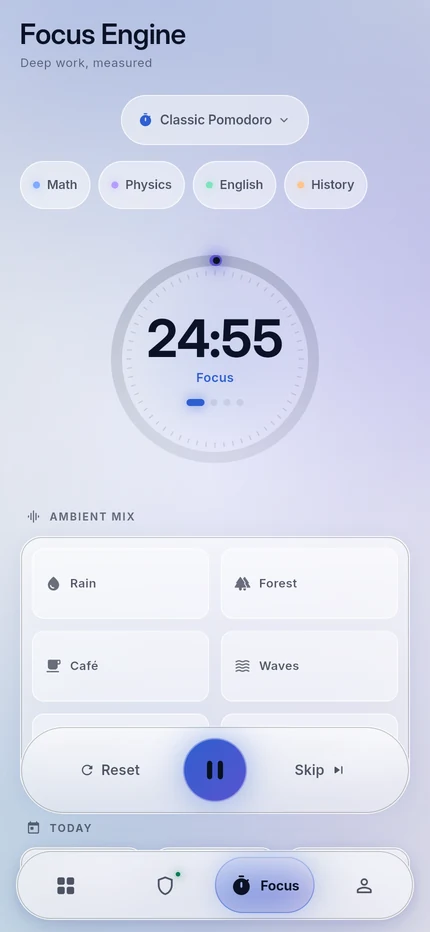 | 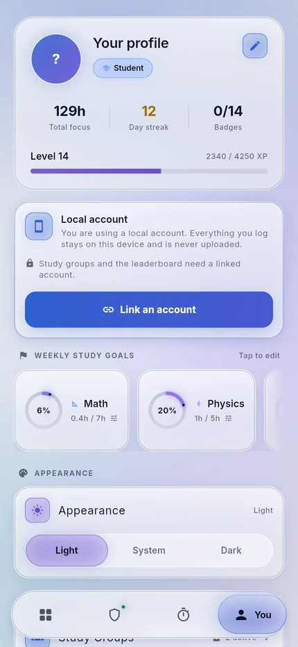 | 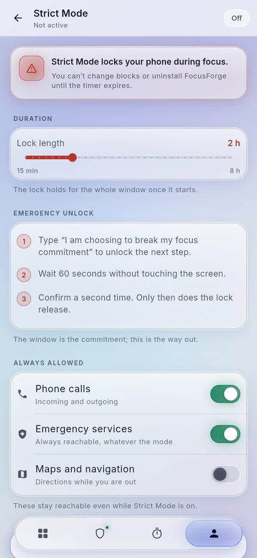 | 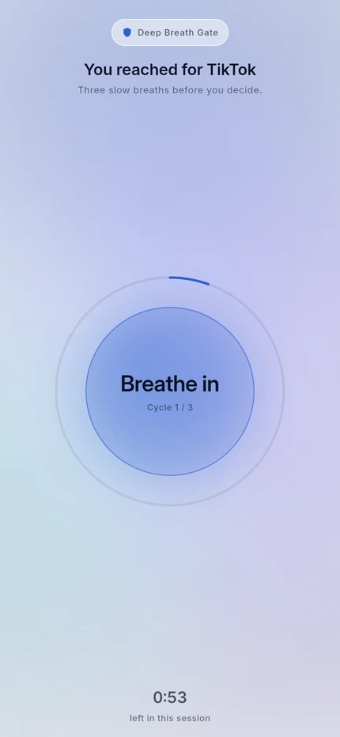 |

| Sign in | Daily goal | Study groups | Dark mode |
|:---:|:---:|:---:|:---:|
| 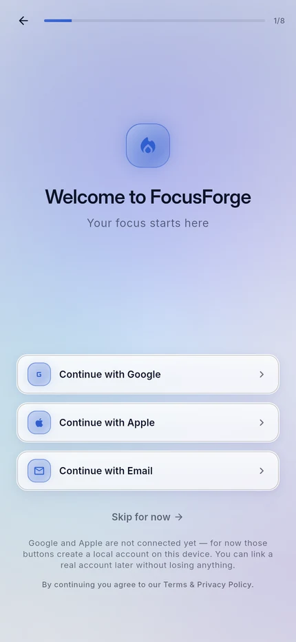 | 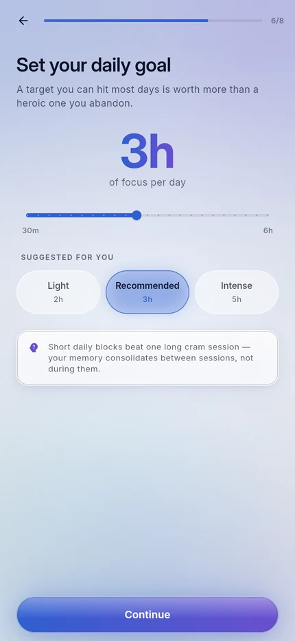 | 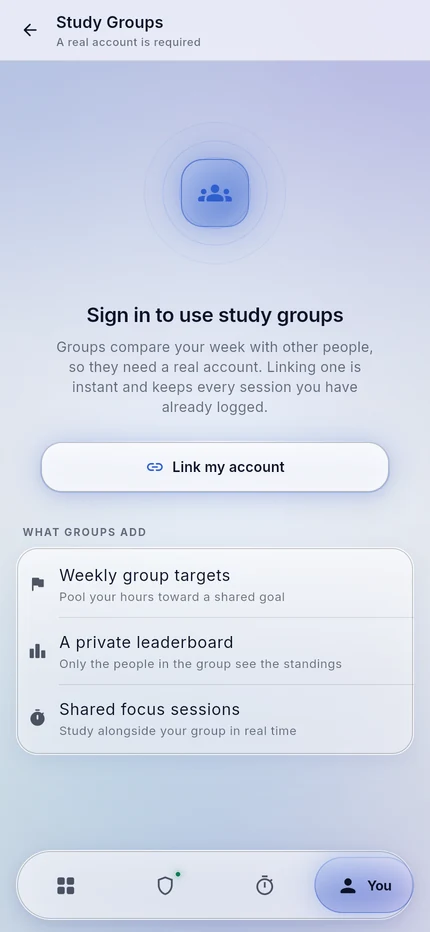 | 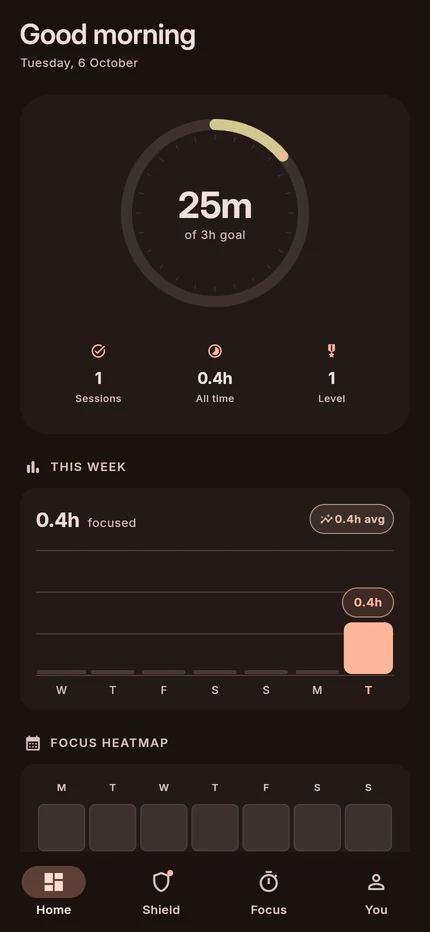 |

</div>

## The design system

The UI follows a **deep glass** language built for 2026 hardware, where GPU
compositing finally makes backdrop blur cheap enough to use properly.

**The floating navigation bar** is the centrepiece:

- It **floats** — inset from every edge, so content scrolls visibly past its
  sides instead of being hidden behind an edge-to-edge slab.
- The active indicator is a **morphing pill**. It stretches while travelling and
  settles with a spring overshoot (`easeOutBack`) rather than snapping.
- It **shrinks on scroll** — labels drop out and the bar shortens as you scroll
  down, then restores on the way back up.
- Its label expands out of the icon on selection, so the bar stays quiet until
  you actually need the word.

**Glass surfaces** are built from four stacked details: a translucent fill, an
inset second rim that reads as edge *thickness*, a soft sheen across the upper
half, and a bright specular line along the top edge. A real `BackdropFilter` is
used sparingly — only for surfaces that genuinely float — because stacking
blurred layers is still the fastest way to wreck a frame budget.

**The canvas** is a gradient with slow-drifting colour blobs, a corner light
source, a vignette and a film-grain overlay. The grain is generated once and
tiled; it is what stops large dark gradients from banding on OLED panels.

**Motion** follows one rule set: fast in, springy out. Presses scale to 0.96 in
90 ms and release on an overshoot curve over 340 ms. Screens use a fade-through
transition, and dashboard sections stagger in at 55 ms intervals.

### Tokens

| Token | Value | Use |
|---|---|---|
| `accentPrimary` | `#A8C7FA` | Primary actions, progress |
| `accentSecondary` | `#D0BCFF` | Secondary elements, XP |
| `success` | `#8FE7C0` | Active shields, completed |
| `danger` | `#FFB4AB` | Over-limit, strict mode |
| `gold` | `#FFD166` | Streaks, achievements |

Radii: hero `28` · card `22` · list item `16` · tile `12` · pill `999`.
Spacing is a strict 8 dp grid. Type is Inter, with Inter Display for the largest
sizes; every numeric style uses tabular figures so digits never jitter.

Day mode is the default. Dark mode shifts the accents to their pastel neon
variants, which is where the glass treatment reads best — toggle it from
**Profile → Dark appearance**.

## Screens

**Onboarding** — a nine-step flow that ends with a profile the rest of the app
can actually use: a splash, an optional account (a real Firebase credential on
Android, an on-device record everywhere else — skip it and the app works
anonymously), a persona that seeds the subject list, name and timezone, subject
picking, app blocking, a daily goal, the permission walkthrough, and a summary.
Back is intercepted so the flow cannot be reversed into a half-built state, and
the coach marks on the dashboard pick up from where it left off.

**Dashboard** — greeting header with streak, a 188 dp progress ring with tick
marks and a lit centre, three stat chips, a weekly bar chart with gridlines and
an accented "today" bar, a five-level focus heatmap, per-app usage rows with
shield toggles, and a subject breakdown bar. Every number is derived from the
session log, so the ring, the chart and the heatmap can never disagree.

**Shield** — a genuinely frosted sticky header (content blurs as it scrolls
under), a three-way segmented control, grouped feed-blocking rows with inline
mode chips, a three-tier whitelist (always allowed / time-budgeted / blocked)
with a search field and budget sliders, horizontally scrolling restriction
profiles, and a Deep Breath Gate that makes breaking a block cost a breath.

**Focus** — Pomodoro / Countdown / Stopwatch with a **drift-free timer** that
advances segments and rolls into breaks, a 60-tick progress ring, subject tags,
a six-channel ambient mixer playing real CC0 loops, and a session dock pinned
above the nav bar so the primary action is always reachable.

**Profile** — hero card with avatar, persona badge and progression stats, an XP
bar, horizontally scrolling weekly subject goals with mini rings, and a settings
list that includes the live theme switch.

**Settings** — seven pushed screens: Study Groups, Achievements (24 badges),
Leaderboard, Strict Mode, Notifications, Data & Privacy (export and delete) and
About.

## Getting started

```bash
git clone https://github.com/MufasaXz/focusforge.git
cd focusforge

flutter pub get

# Desktop / device
flutter run

# Or run it in a browser
flutter run -d chrome
```

Requires **Flutter 3.47+** (Dart 3.13+). The dependency list is deliberately
short and audited — every entry earns its place:

| Package | Why it is here |
|---|---|
| `firebase_core` | Initialises the account backend — and is optional: a failure falls back to the on-device store |
| `firebase_auth` | Real credentials, so an account survives a reinstall instead of living only in `shared_preferences` |
| `flutter_riverpod` | State, dependency injection and the drift-free timer engine |
| `go_router` | The route graph, including the per-tab navigator stacks |
| `just_audio` | The ambient mixer needs real cross-platform playback |
| `shared_preferences` | Local persistence for everything the app remembers |
| `confetti` | Session-completion celebration |
| `shimmer` | Skeleton loading states |

Everything else is hand-written: the charts, the heatmap, the progress ring,
the glass surfaces, the navigation bar and the whole motion system.

Firebase holds **only the credential**. `AuthService` is an interface with two
implementations, and `bootstrap()` picks one before the first frame:
`FirebaseAuthService` when `Firebase.initializeApp()` succeeds, and
`LocalAuthService` when it does not — offline, on web, or in a build with no
`google-services.json`. The app is fully usable either way; the profile record
stays in `shared_preferences` regardless. See [Privacy](#privacy).

`cupertino_icons` is deliberately **not** a dependency — nothing in the app uses
a Cupertino icon. The release build still prints one warning about it, because
`go_router` references `CupertinoPageTransitionsBuilder` and that pulls the
framework's Cupertino library into the retained tree, so the icon tree-shaker
sees the font family. No Cupertino icon is ever rendered; the warning is noise.

### Build for web

```bash
# --no-web-resources-cdn bundles CanvasKit locally instead of pulling it from
# gstatic, which makes local previews fast and deterministic.
flutter build web --release --no-web-resources-cdn
```

## Project structure

```
lib/
├── app/
│   ├── app.dart                 # MaterialApp.router, theme binding
│   ├── bootstrap.dart           # Opens the store, rehydrates before first frame
│   ├── router.dart              # go_router graph + AppRoutes name map
│   ├── shell/app_shell.dart     # Tab host, status-bar theming, lifecycle resync
│   └── theme/                   # Tokens, type scale, ThemeData
├── core/
│   ├── data/seed.dart           # First-run content (the only "demo data" left)
│   ├── models/                  # Immutable domain models + icon registry
│   ├── providers/               # Riverpod: app, study, shield, audio, social
│   ├── services/                # LocalStore, AuthService (+Firebase/local impls), AmbientMixer, ShieldPlatformService
│   └── utils/format.dart        # Duration / date formatting
├── shared/widgets/              # The design system, all hand-built
└── features/
    ├── onboarding/              # Splash → auth → persona → … → permissions
    ├── dashboard/               # + widgets/ (chart, heatmap, apps, subjects)
    ├── shield/                  # Feed blocking, whitelist, profiles, breath gate
    ├── focus/                   # Timer, presets, ambient mixer
    ├── profile/                 # Identity, progression, settings entry
    └── settings/                # The seven pushed sub-screens
```

### Architecture notes

**The timer is not a counter.** `TimerNotifier` stores the wall-clock instant a
segment ends and recomputes the display from it on every tick, so a backgrounded
app that receives no timers for an hour is still correct when it wakes. Counting
ticks would silently lose that hour.

**Nothing reads `SeedData` in a shipping screen.** `seed.dart` is first-run
content only; after that the local store is authoritative and every screen reads
a provider. The one deliberate exception is onboarding, which uses the seed to
offer a sensible starting set of subjects and apps to a user who has no history
to derive them from.

**The UI never touches a platform channel.** Shield mutations go through
`ShieldPlatformService`; today the only implementation records what it was
asked to do, so the contract is exercised and testable before the native
engine exists.

**Icons never cross the storage boundary as integers.** `flutter build apk`
tree-shakes icons by finding constant `IconData`; one rebuilt from a runtime
int is invisible to that analysis and renders blank in release. Persisted icons
go through `AppIcons` by name.

## Privacy

Screen-time analytics and usage data stay **on-device**. The only remote
service is Firebase Authentication, and it holds nothing but a credential —
an opaque uid, an email if you gave one, and the provider you used. Persona,
daily goal, subjects, session log, shield rules and every statistic stay in
`shared_preferences` and are never uploaded. Study-group membership, opt-in
leaderboard scores and synced settings are the planned additions, and they
will be opt-in and separable. You can export or delete everything at any time —
deleting an account removes the Firebase credential *and* wipes the local
store.

## Assets

The six ambient loops in `assets/audio/` are **CC0 1.0** (public domain), sourced
from Freesound with the licence verified on each individual source page rather
than by a search filter. Each was trimmed to a 66-second window, rebuilt as a
seamless loop (the 1 s tail crossfades into the 1 s head, so there is no click at
the wrap point), downmixed to mono and loudness-normalised to −23 LUFS so no loop
drowns the others. Per-file provenance and the exact processing chain are in
[`assets/audio/CREDITS.md`](assets/audio/CREDITS.md).

## App Store reality check

The anti-uninstall approach that some blockers use **will be rejected** by both
Google Play and Apple. FocusForge uses an emergency unlock with friction instead
(typed pledge + 60-second cooldown), which is both store-legal and more
effective. `AccessibilityService` on Android needs a clear privacy policy and a
written justification at review time; iOS ScreenTime requires the
`FamilyControls` entitlement.

## Contributing

Issues and PRs are welcome — see [CONTRIBUTING.md](CONTRIBUTING.md). Good first
issues are labelled in the tracker.

## License

[MIT](LICENSE) — free forever, no ads, no tracking, no premium tier.
