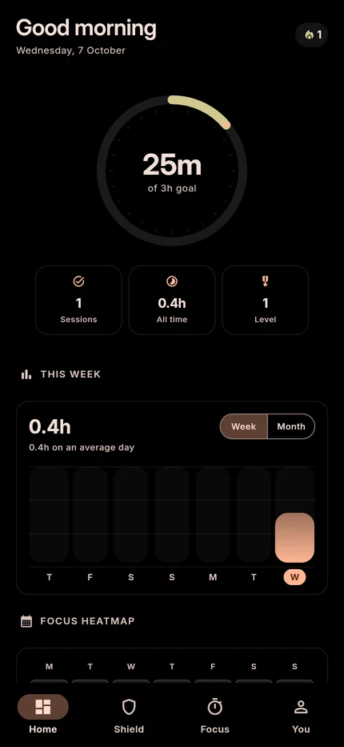
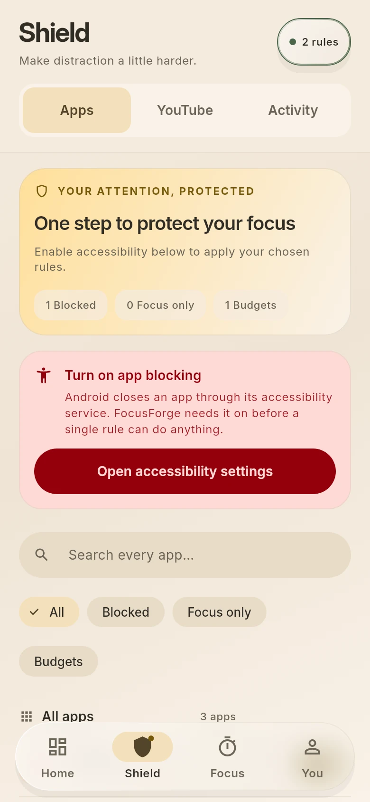
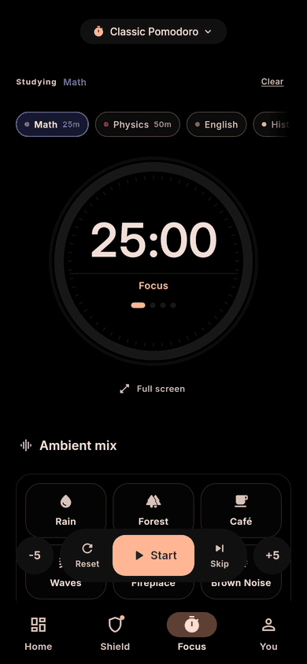
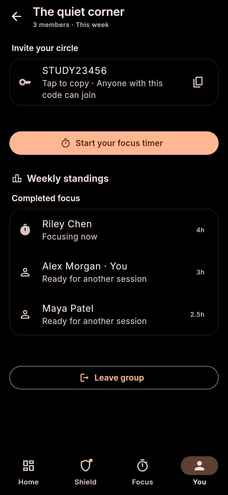

LESS SCROLLING. MORE STUDYING.

# FocusForge

### Close the feed. Keep the lecture.

A study companion that protects your attention and makes your progress visible.

**Free & open source** · No ads · No subscriptions

[Download for Android](https://gofile.io/d/rNa0QELz) · [Report an issue](https://github.com/MufasaXz/focusforge/issues) · [Contribute](CONTRIBUTING.md)

Version 1.0.1 · Android 7.0+

 

  
  
  <picture>
    <source media="(prefers-reduced-motion: reduce)" srcset="docs/screenshots/03-focus.webp">
    
  </picture>
  

Home &nbsp; / &nbsp; Shield &nbsp; / &nbsp; Focus &nbsp; / &nbsp; Together

---

**Protect your attention.** Block distracting apps, set daily time budgets, or
shield them only while you focus. Filter YouTube Shorts and feeds while keeping
lecture links available.

**Find your rhythm.** Use Pomodoro presets or your own plan, tag a subject, and
mix ambient sounds. A full-screen timer keeps the next step simple.

**Pause before the scroll.** A guided 4–7–8 breathing break gives you room to
decide whether to open a shielded app. Strict Mode adds a deliberate cooldown
before ending your commitment.

**See the work add up.** Daily goals, subject totals, weekly charts and streaks
show the time you actually studied. Earn XP and badges along the way.

**Study with your circle.** Join private groups with an invite code, work toward
a shared weekly goal, and see who has a focus timer running.

**Support from a parent.** Pair two devices to share study summaries and let a
parent manage distraction rules.

---

Start with your subjects and a daily goal. The timer works without an account;
Shield uses optional Android permissions. Detailed session logs stay on your
device. Groups and parent control share limited summaries when you choose them.

[Firebase setup](docs/firebase-setup.md) · [Installation help](docs/play-protect.md) · [MIT license](LICENSE)
