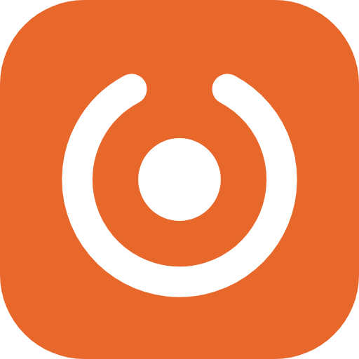
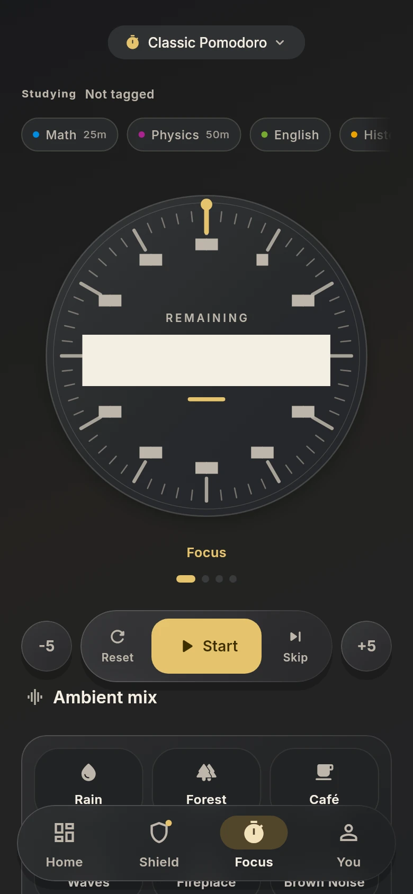
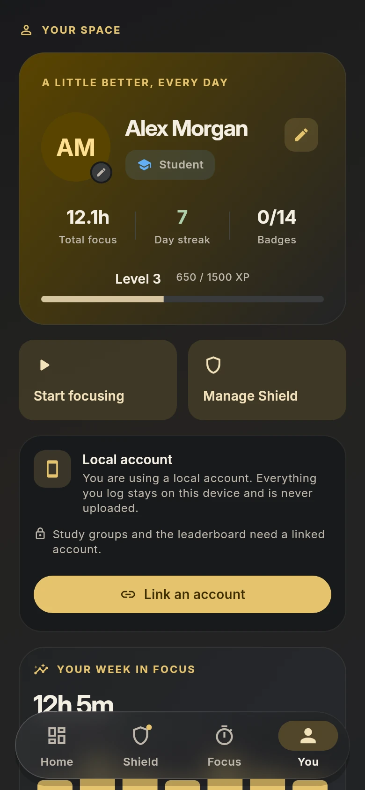

<div align="center">



# FocusForge

**An open-source, privacy-first study companion.**
Close the feeds, run the timer, watch the streak grow.

[](https://flutter.dev)
[](https://dart.dev)
[](LICENSE)
[](CONTRIBUTING.md)
[](#)





<sub>Home · Shield · Focus · You — true black, because this is a screen you leave on a desk.</sub>

</div>

---

FocusForge is four things in one app: a **shield** that takes the endless feeds
out of the apps you lose time to, a **timer** that keeps you in the chair,
**analytics** that come from your own session log, and a **streak** that makes
tomorrow easier to start.

It is free — no ads, no premium tier, no tracking — and it works signed out.
Your detailed session log stays on the device. Optional groups and parent
control share limited summaries with the people you choose.

## What it does

Every heading below opens: the line is what the feature is, the body is how it
works.

<details>
<summary><b>The shield</b> — close the feed, not the app</summary>

Most blockers are all-or-nothing: you want the feed gone, so you lose the app
with it. The shield draws the line where you draw it.

- **Per-app rules, three tiers.** *Blocked* closes an app as soon as it opens,
  *Time budgeted* gives it the day's allowance and closes it when that is spent,
  and *Always allowed* is for the apps your work runs through. The Apps tab is
  the list of apps you actually installed — a switch applies the moment you flip
  it, with nothing to enable afterwards.
- **YouTube, surface by surface.** Close Shorts while ordinary videos keep
  playing, and remove the recommendation feed while a lecture link still opens.
  Two switches, because "no Shorts" and "no YouTube" are different requests.
- **The Deep Breath Gate.** Reach for a blocked app and you get a 4-7-8 breath
  first. The pause gives you a chance to decide.
- **Activity, in plain language.** What was closed, what you walked away from,
  and how long the apps you have rules for were open.
- **It says when a rule cannot fire.** A time budget with no usage access is
  armed but inert, and the status pill says so rather than letting you believe
  you are covered.

The engine is an Android `AccessibilityService` that re-reads its rules from
storage when it starts, so it keeps working while the Flutter engine is not
running.

</details>

<details>
<summary><b>The timer</b> — honest about time</summary>

- **Four presets** — Classic Pomodoro (25/5), Deep Work (50/10), Sprint (15/3)
  and Flow State (90/20) — plus a custom plan you set yourself. Each rolls into
  its own breaks.
- **It counts from the wall clock, not from ticks.** Put the phone down
  mid-session, come back an hour later, and the timer is right. It also writes
  a block into your log when a session finished while the app was not alive to
  watch it.
- **Subjects**, so every session lands against the right one.
- **Protected session controls.** Resetting, skipping or changing plans asks
  before discarding an unfinished focus block. Choosing the current preset
  leaves the timer running.
- **A six-channel ambient mixer** — rain, forest, café, waves, fireplace, brown
  noise — real loops you can layer, and they keep playing under the session.

</details>

<details>
<summary><b>The clock</b> — five faces, and a full-screen mode</summary>

- **Flip, Segments, Minimal, Analog and Neon.** The analog face runs its hands
  down: they read the time left in the segment, so they meet at twelve as it
  empties.
- **Double-tap the clock** and it fills the screen, either way up. That screen
  draws the session around the window's own edge — a line that starts at the
  middle of the top edge and walks the boundary as the segment runs. A focus
  closes the loop on the last second; a break opens with the boundary whole and
  gives it back.
- **A visible Full screen button** opens the same view with a tap or keyboard.
- **True black reaches it too**, and the wash of phase colour is dropped there,
  because this is the one screen left on for an hour.

</details>

<details>
<summary><b>The dashboard</b> — numbers that cannot disagree</summary>

Every figure is derived from the same session log, so the ring, the chart and
the heatmap can never tell different stories.

- A daily progress ring against the goal you set, and your current streak
- A weekly bar chart, and a five-level focus heatmap
- Per-app screen time with a shield switch on each row
- A subject breakdown, and where today actually went
- Start or resume your chosen plan from Home, with its current subject and
  remaining time. Opening a running timer keeps its deadline.
- Tap a day for its subject totals and a chronological session log, including
  start times and focused minutes. The week chart also works with a keyboard
  and screen reader.

Pull to refresh updates device usage without hiding the saved study log.

</details>

<details>
<summary><b>Progress</b> — levels, badges, goals, groups</summary>

- Levels and XP, earned from focused minutes
- 14 badges, from your first session to the hundredth hour
- Weekly study goals per subject, each with its own ring
- Study groups and a leaderboard once you link an account

</details>

<details>
<summary><b>Strict Mode</b> — the decision, made in advance</summary>

Lock the phone for a session, from fifteen minutes to eight hours, and let the
past you decide.

Getting out is possible, and deliberately slow: type the commitment phrase,
wait out a sixty-second cooldown, then confirm. Three steps that take long
enough to think in — no uninstall tricks, and nothing a store would reject.

</details>

<details>
<summary><b>Appearance</b> — six palettes, light, dark, and true black</summary>

Each palette is a seed *pair*: dark mode is a brighter mix of the same hue
rather than a desaturated copy of the light one. Appearance follows the system
by default and can be pinned to light or dark; **true black** ships on, so a
dark system gets the pure `#000000` surface family without anyone opening a
setting. It leaves every accent alone — the whole app, the full-screen clock
included — and can be switched off.

Session entrances, the week chart and focus controls honour reduced motion;
the ambient meters stay still. With motion enabled, entrances travel the same
small distance regardless of the card's height and wait for their tab to open.
The timer arc follows live updates with a short transition, and play/pause
changes settle in place. Display and headline styles use the bundled Inter
Display cut; supporting text uses Inter, with theme-aware contrast in both modes.

</details>

<details>
<summary><b>Privacy</b> — what is stored, and where</summary>

Screen time, sessions, personal shield rules and statistics live on the phone.
An account is optional. Firebase holds the sign-in credential when connected.

Joining a study group shares your display name, completed minutes for the UTC
week and the end time of an active focus timer with members. Leaving removes
your row. The weekly public board remains a separate opt-in. Pairing a parent
shares study summaries and installed app names so they can choose remote rules.
Messages, passwords, accessibility screen checks and session logs are never uploaded.

Export local data as JSON, leave groups, unlink parent control or delete the
account in Data & Privacy. Account deletion removes group membership before
deleting the credential and wiping the local store. Older parent/board records
are not automatically purged; unlink and opt out before deleting an account.

See [Firebase setup](docs/firebase-setup.md) and
[Play Protect guidance](docs/play-protect.md).

</details>

## Under the hood

- **Flutter** for the app. The charts, the motion system and the skeleton states
  are written here — no charting, animation or shimmer package is imported
  anywhere.
- **Kotlin** for the shield: an accessibility service, its own overlay for the
  pause screen, and a rule model that the Dart side only configures.
- **139 tests** across models, providers and screens, including widget tests
  that pump each screen in every state it can be opened in.
- **The screenshots above are not staged.** They come from driving the real
  build through its accessibility tree in a headless browser — the same path a
  screen reader takes, so a control the harness cannot find is a control
  assistive technology cannot find either.

## Getting started

On first launch the app walks you through setup in about a minute: pick a
persona, choose your subjects, set a daily goal, and grant the permissions you
are comfortable with. Every one of them is optional, and the app says plainly
what each is for.

```bash
git clone https://github.com/MufasaXz/focusforge.git
cd focusforge
flutter pub get

flutter run                 # desktop, device or emulator
flutter build apk --release # installable Android build
```

The current Android release configuration is **1.0.1 (build 6)**. The release
task also copies the signed APK to
`build/app/outputs/flutter-apk/focusforge-1.0.1.apk`.

First-run setup has named progress stages, larger Inter Display headings and
short transitions that respect reduced motion. Choices and profile drafts stay
in place when you go back. Short screens and the keyboard use a scrollable
layout so actions remain reachable. Parent devices skip study goals and local
Shield permissions and finish at phone pairing; devices used for studying keep
the subject and daily-goal steps. Permissions are optional and show their
current system status before asking.

Requires **Flutter 3.47+** (Dart 3.13+). App blocking needs Android; everything
else runs anywhere Flutter does.

### Installing the APK

Google Play Protect scans apps installed from outside the Play Store, and on
many devices it hard-blocks apps that declare accessibility access — which is
the access the shield runs on. If the installer says **App blocked to protect
your device**, there are three ways through:

1. Tap **More details → Install anyway**, if the dialog offers it.
2. Or pause the scanner first — **Play Store → profile → Play Protect → gear
   icon → pause app scanning** — install, then turn it back on.
3. Or install over a cable: `adb install focusforge-1.0.0.apk`. An adb install
   does not go through the package installer's scanner at all.

Devices without Google services have no such block.

## Contributing

Issues and pull requests are welcome — see [CONTRIBUTING.md](CONTRIBUTING.md)
for how to get set up and what makes a good change. Good first issues are
labelled in the tracker.

## License

[MIT](LICENSE) — free forever, no ads, no tracking, no premium tier.
