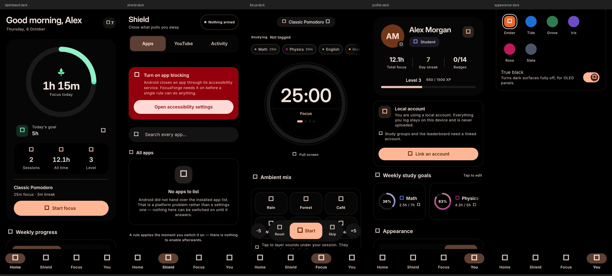
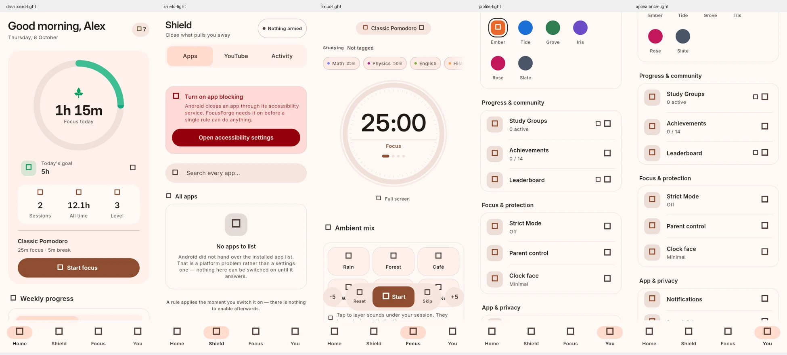
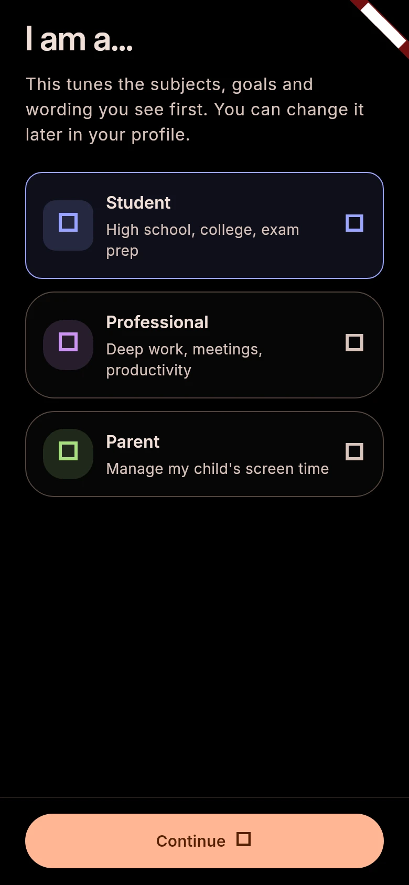
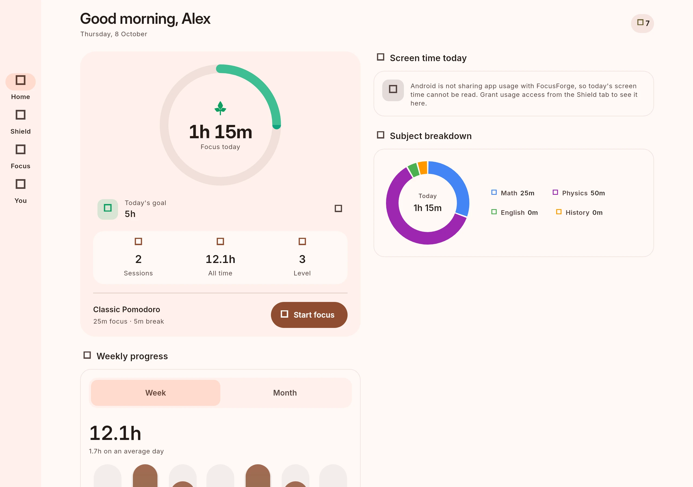
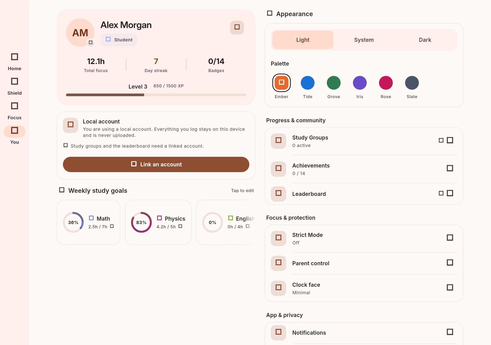

# October UI refinement

FocusForge keeps its ember palette, Inter/Inter Display fonts, goal ring and
true-black option. This pass makes the hierarchy and interactions clearer:

- 20dp card corners, sentence-case section headings and consistent spacing.
- A shared 48dp segmented control with a moving tonal selection surface.
- A separate range selector and prominent focus total on the dashboard.
- Daily metrics grouped on one surface, with a stacked layout for large text.
- Profile settings grouped by purpose; long values live below their labels.
- Named palette choices and a shape change when a palette is selected.
- Named ambient tracks with stable placement when playback starts.
- A labelled Start/Pause control where space allows, and softer setup choices.

Every new animation respects reduced motion. Colour follows the live scheme,
and categorical persona, subject and sound hues are harmonized.

## Reference review

The implementation is original Flutter code. No external source, fonts, icons
or other assets were copied. These repositories were reviewed as visual and
interaction references:

| Reference | Useful direction | Repository license at review |
| --- | --- | --- |
| [Dioxamine](https://github.com/rhythmcache/Dioxamine) | Group settings by purpose and use tonal surfaces for hierarchy | Apache 2.0 |
| [Plexo](https://github.com/anmolkapil/plexo) | Give primary metrics room and keep supporting labels quieter | MIT |
| [Kimon](https://github.com/zenzer0s/kimon) | Make the timer action prominent and use deliberate rounded shapes | PolyForm Noncommercial 1.0.0 |
| [UniStack](https://github.com/Kmlozmz/UniStack) | Consistent screen chrome and explicit motion preferences | Proprietary, all rights reserved |
| [Minus](https://github.com/isaacsa51/Minus) | Distinguish numeric values from labels and group related metrics | Apache 2.0 |
| [Deep](https://github.com/shad-ct/deep-peep) | Tactile feedback and readable card labels | No license file found |

## Captures

These are widget-rendered captures using the bundled fonts and fictional local
session data. They document phone and tablet layouts; native Android permission
dialogs and audio playback need device testing.











Regenerate the source PNGs with:

```sh
flutter test tool/capture_ui_test.dart
```

The PNGs are written to `build/ui-review/`. The harness is outside the default
test suite so ordinary tests never rewrite screenshots.

Validation: 204 tests passed, static analysis clean, release web build passed.
Additional checks cover 320dp screens with 2x text, RTL selection semantics,
reduced motion, timer start/pause and restored ambient selections.
